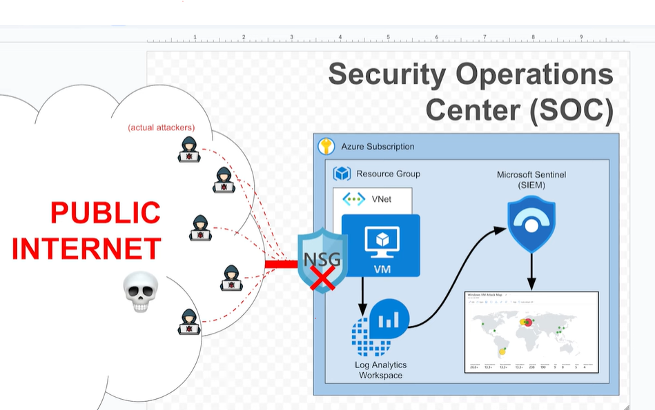
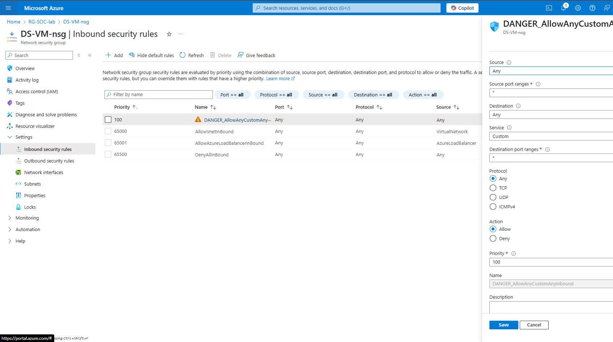
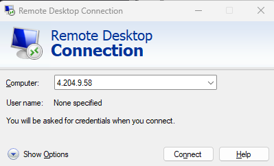
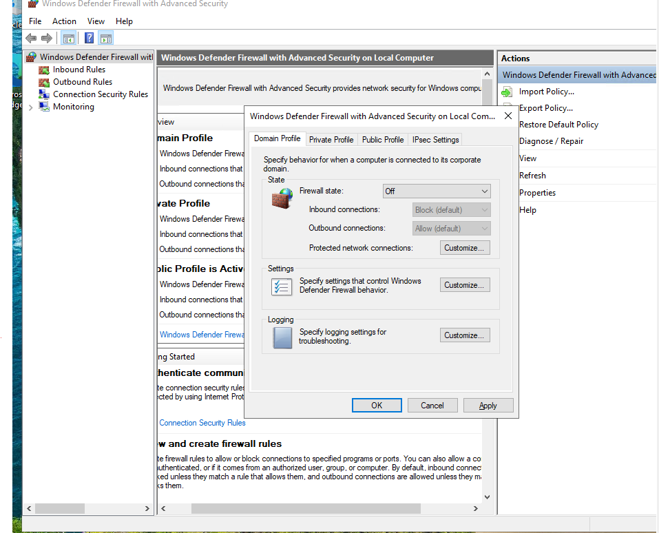
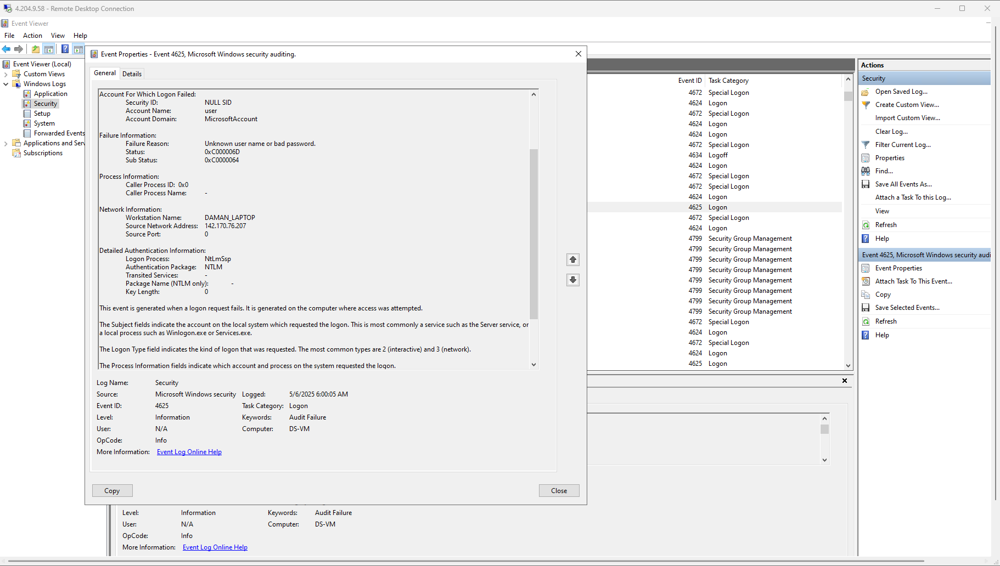
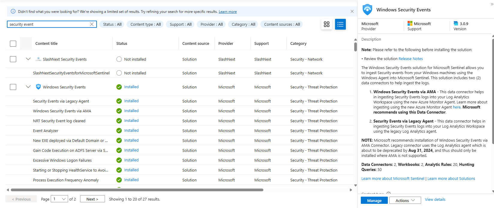
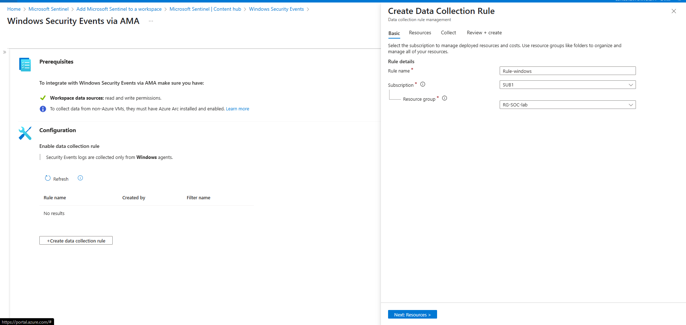
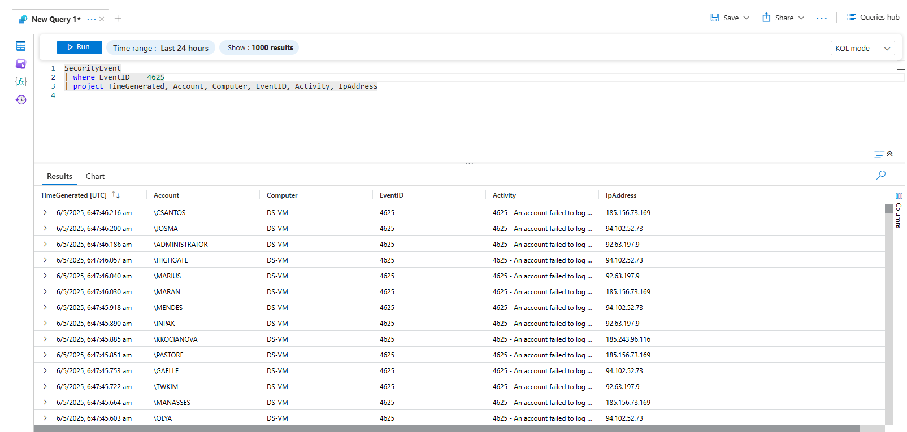
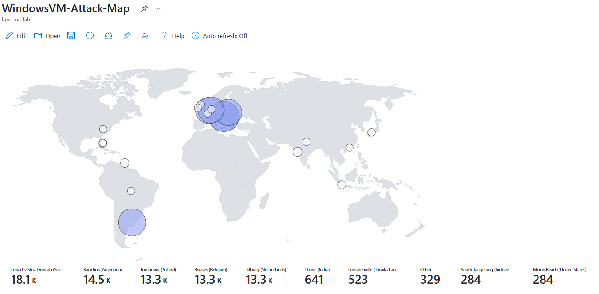

# Home-Lab-Sentinel

This project sets up a **Windows 10 honeypot on Azure**, forwards logs to **Log Analytics Workspace**, enriches them with **GeoIP data**, and visualizes global attack patterns using **Microsoft Sentinel** workbooks and KQL.



---

## 📌 Project Overview

We will:
- Create an Azure VM honeypot exposed to the public internet.
- Configure log forwarding to a central **Log Analytics Workspace (LAW)**.
- Connect **Microsoft Sentinel SIEM** to the Log Analytic Workspace.
- Import GeoIP data as a Sentinel Watchlist.
- Use KQL to correlate attacker IPs with location data.
- Build a dynamic **attack map** inside a Sentinel workbook.

---

## 📂 Table of Contents

1. [Prerequisites](#prerequisites)  
2. [Part 1: Setup Azure Subscription](#part-1-setup-azure-subscription)  
3. [Part 2: Deploy Honeypot VM](#part-2-deploy-honeypot-vm)  
4. [Part 3: Log Collection](#part-3-log-collection)  
5. [Part 4: Log Enrichment](#part-4-log-enrichment)  
6. [Part 5: Attack Map Creation](#part-5-attack-map-creation)  
7. [Screenshots](#screenshots)

---

## ✅ Prerequisites

- Azure subscription ([Sign up here](https://azure.microsoft.com/en-us/pricing/purchase-options/azure-account))
- Basic familiarity with:
  - Virtual machines
  - Remote desktop (RDP)
  - Azure portal navigation
- CSV file: `geoip-summarized.csv`

---

## 🚀 Part 1: Setup Azure Subscription

- Create a free Azure account  
- Access Azure Portal: [https://portal.azure.com](https://portal.azure.com)

---

## ⚙️ Part 2: Deploy Honeypot VM

- Deploy **Windows 10 VM** on Azure
- Open all inbound traffic in the **Network Security Group**
- Disable **Windows Firewall** inside VM







---

## 📥 Part 3: Log Collection

- Log in to your virtual machine
- Open up Event Viewer and inspect the security logs (fail 3 logins as "employee ")



- Set up **Log Analytics Workspace**
- Create a Sentinel Instance and connect it to Log Analytics
- Configure the “Windows Security Events via AMA” connector
- Create the DCR within Sentinel, and watch for extension creation
- Connect **Microsoft Sentinel** to LAW





Observe some of your VM logs

```kql
SecurityEvent
| where EventId == 4625
```



---

## 🌎 Part 4: Log Enrichment

Observe the SecurityEvent logs in the Log Analytics Workspace; there is no location data, only the IP address, which we can use to derive the location data.

We are going to import a spreadsheet (as a “Sentinel Watchlist”), which contains geographic information for each block of IP addresses


- Upload `geoip-summarized.csv` as a Sentinel Watchlist
- Enrich logs with location data using KQL and `ipv4_lookup`

Observe that the logs now have geographic information, so you can see where the attacks are coming from

```kql
let GeoIPDB_FULL = _GetWatchlist("geoip");
let WindowsEvents = SecurityEvent
    | where IpAddress == <attacker IP address>
    | where EventID == 4625
    | order by TimeGenerated desc
    | evaluate ipv4_lookup(GeoIPDB_FULL, IpAddress, network);
WindowsEvents
```

---

## 🗺️ Part 5: Attack Map Creation

- Create Sentinel **Workbook**
- Insert attack map JSON template

#### Sentinel Workbook JSON Configuration

```json
{
    "type": 3,
    "content": {
        "version": "KqlItem/1.0",
        "query": "let GeoIPDB_FULL = _GetWatchlist(\"geoip\");\nlet WindowsEvents = SecurityEvent;\nWindowsEvents | where EventID == 4625\n| order by TimeGenerated desc\n| evaluate ipv4_lookup(GeoIPDB_FULL, IpAddress, network)\n| summarize FailureCount = count() by IpAddress, latitude, longitude, cityname, countryname\n| project FailureCount, AttackerIp = IpAddress, latitude, longitude, city = cityname, country = countryname,\nfriendly_location = strcat(cityname, \" (\", countryname, \")\");",
        "size": 3,
        "timeContext": {
            "durationMs": 2592000000
        },
        "queryType": 0,
        "resourceType": "microsoft.operationalinsights/workspaces",
        "visualization": "map",
        "mapSettings": {
            "locInfo": "LatLong",
            "locInfoColumn": "countryname",
            "latitude": "latitude",
            "longitude": "longitude",
            "sizeSettings": "FailureCount",
            "sizeAggregation": "Sum",
            "opacity": 0.8,
            "labelSettings": "friendly_location",
            "legendMetric": "FailureCount",
            "legendAggregation": "Sum",
            "itemColorSettings": {
                "nodeColorField": "FailureCount",
                "colorAggregation": "Sum",
                "type": "heatmap",
                "heatmapPalette": "greenRed"
            }
        }
    },
    "name": "query - 0"
}
```

- Visualize real-time global attack data on a map



---
